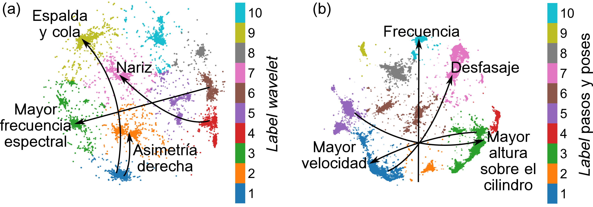
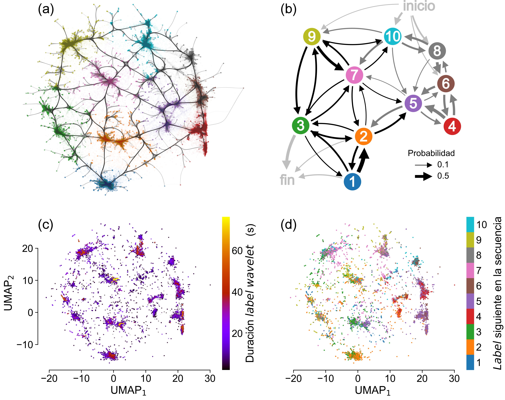
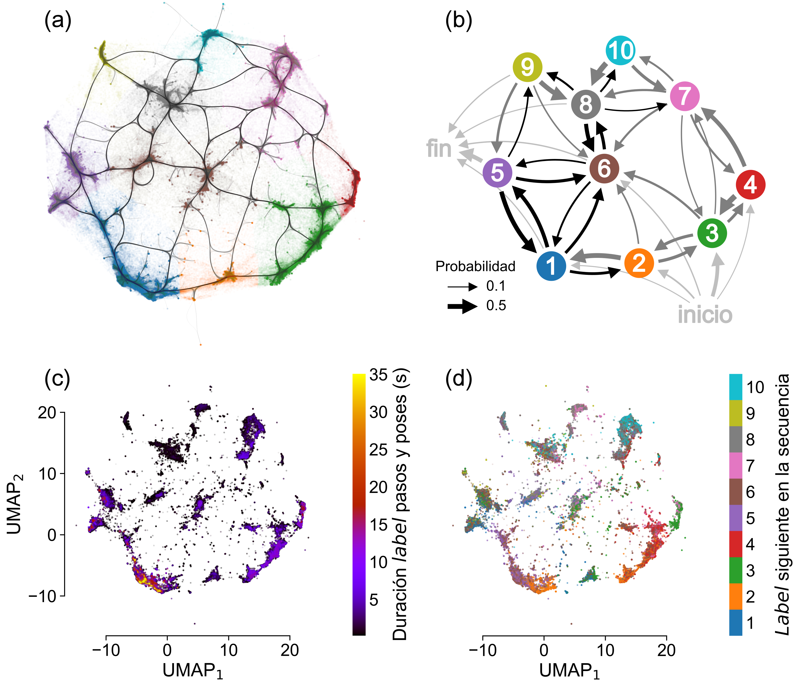

    

# Representations of animal behavior in a motor skill learning task

MSc dissertation project, written using LaTeX.

Author: Alvaro Concha

Advisor: PhD Soledad Espósito

Co-advisor: PhD Damián Hernández

## Abstract

Animals exhibit complex behavioral repertoires that can be described, with varying degrees of detail, as combinations from a finite set of stereotyped movements or biophysical states.
These biophysical responses are flexible, since different behavior sequences can be used to solve similar tasks, and are adaptable to changing environments through learning mechanisms.
Given this flexibility and adaptability, translating complex animal behaviors into quantifiable features or well-defined behavior categories can be challenging.
On the one hand, manual classification of behaviors can be time-consuming, require the definition of _a priori_ categories and may not bereproducible between assessments.
On the other hand, heuristically created categories (e.g., walking, running or jumping) tend to ignore inherent information regarding intra- and inter-animal variability, frequently found in unrestrained naturalistic settings.

Therefore, in this work we analyze different approaches to quantify and evaluate mouse behavior during the execution of a motor skill learning task (accelerating rotarod). In particular, we apply unsupervised machine learning techniques to classify behaviors (UMAP embeddings with watershed segmentation).
First, we proposed performance metrics,  alternative to latency to fall, to showcase varying levels of physical aptitude and task learning amongst mice.
We then used UMAP embeddings to find two possible representations of mouse behavior, in a low dimensional latent space.
One embedding was constructed using mouse bodyparts' wavelet frequency spectra and the other using features extracted from their steps and poses.
Finally, we clustered behaviors into separate categories (labels), by performing watershed segmentation, and characterized them.
In this way, we shed light on the underlying structure and dynamics of behavior, improving our understanding of the execution and learning process of this task. The behaviors found can distinguish between the different mouse performance groups, and the way these behaviors are used is consolidated during training.

